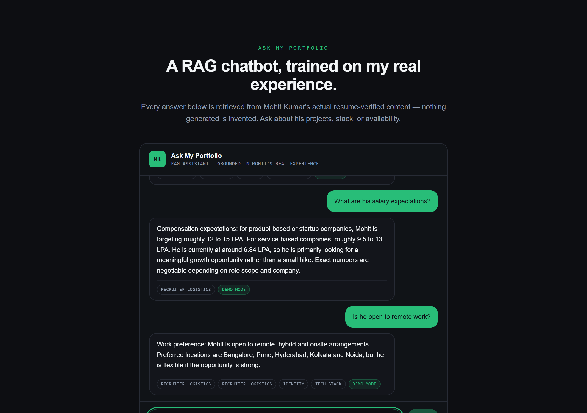
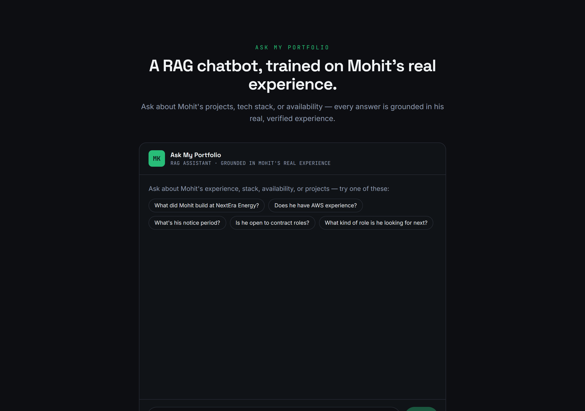
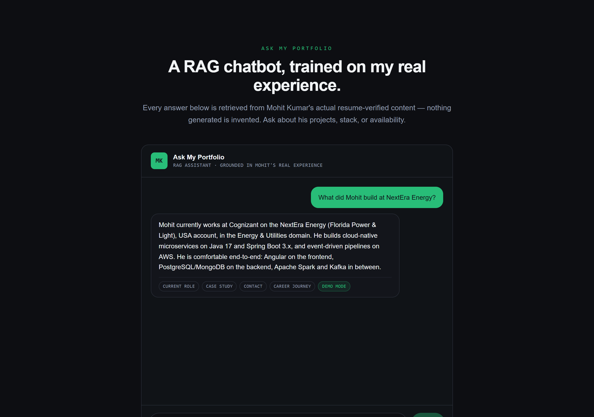
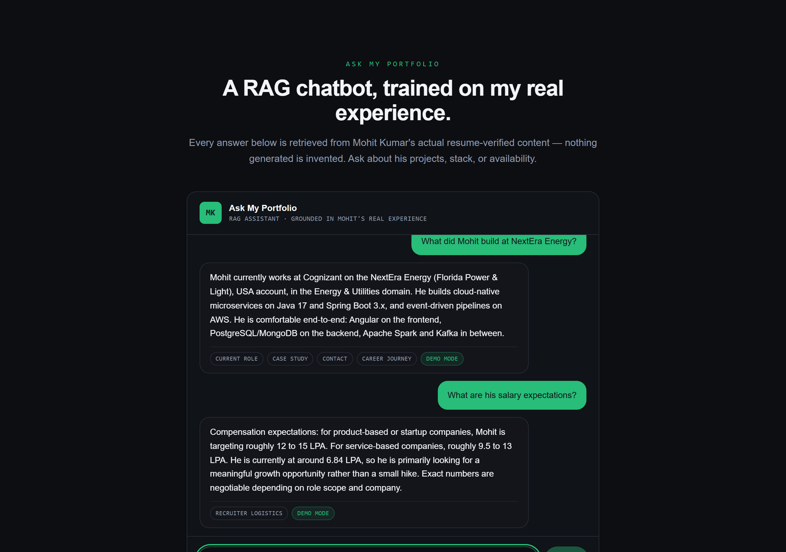
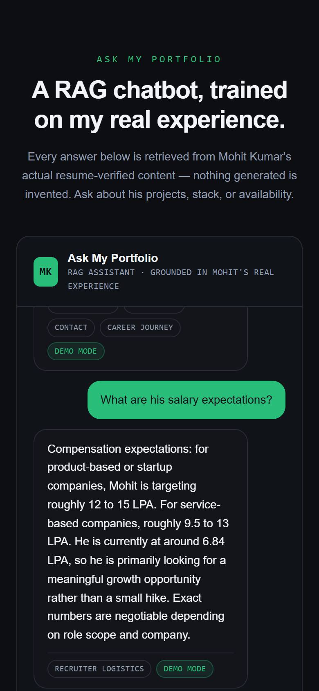

# Ask My Portfolio

A retrieval-augmented generation (RAG) chatbot embedded in a portfolio site. A recruiter can ask "What did Mohit build at NextEra Energy?" or "Is he open to contract roles?" and get an answer grounded in his real, resume-verified data — not a generic canned bot, and not a hallucinated one.

**Live demo:** https://ask-my-portfolio-khaki.vercel.app/



## Why this exists

Most portfolio "AI" sections describe RAG conceptually. This one *is* a working RAG pipeline, built specifically to answer the questions a recruiter actually asks — including logistics (notice period, comp expectations, work mode) that don't fit naturally into a resume.

## How it works

```
User question
     │
     ▼
TF-IDF retrieval over a fixed knowledge base   (lib/retrieval.js)
     │  → top-4 most relevant chunks, each with a similarity score
     ▼
Prompt assembly: system instructions + retrieved context   (lib/prompt.js)
     │
     ▼
Groq (Llama 3.1) generates the answer, grounded only in that context
     │
     ▼
Response + source tags returned to the UI
```

See [`docs/ARCHITECTURE.md`](docs/ARCHITECTURE.md) for the full flow diagram and the reasoning behind each decision, and [`docs/INTERVIEW_PREP.md`](docs/INTERVIEW_PREP.md) for how to talk about this project out loud.

### A deliberate design choice: graceful degradation

If `GROQ_API_KEY` isn't set, `/api/chat` doesn't break — it returns the single most relevant retrieved chunk directly instead of a generated answer (tagged `"mode": "extractive"` in the response, and shown as a **demo mode** badge in the UI). Anyone who clones this repo gets a working demo with zero setup; the generative layer is additive, not a hard dependency.

### Why TF-IDF instead of a learned embedding model

The knowledge base is ~25 short chunks. A classic TF-IDF/cosine-similarity retriever is fast, deterministic, fully explainable, and has zero model-download cold-start cost on a serverless function. A learned embedding model (e.g. via `transformers.js`) is the natural next step once the corpus grows past a few hundred chunks — noted here deliberately as a trade-off, not an oversight.

## Screenshots

| Empty state | First answer |
|---|---|
|  |  |

| Multi-turn conversation | Mobile |
|---|---|
|  |  |

## Tech stack

- **Frontend:** React 19 + Vite + Tailwind CSS v4
- **Backend:** Vercel serverless function (Node.js), no separate server to manage
- **Retrieval:** hand-rolled TF-IDF/cosine-similarity (see above — a deliberate choice, not a missing feature)
- **Generation:** [Groq](https://groq.com) API, `llama-3.1-8b-instant` — fast, free tier, no credit card
- **Knowledge base:** `lib/corpus.js` — structured chunks sourced from the same verified data as [the main portfolio](https://mohit-java-caps.github.io/mohit-portfolio/)

## Running locally

```bash
npm install
npm run dev
```

This starts the Vite dev server *and* a local Node emulator for the `/api/chat` serverless function together (`concurrently`), proxied so the frontend can call `/api/chat` exactly as it will in production. No Vercel CLI or account needed for local development.

Open `http://localhost:5173`.

### Enabling generated (not just extractive) answers locally

```bash
cp .env.example .env
# then edit .env and paste in a Groq API key from https://console.groq.com
```

## Deploying

1. Push this repo to GitHub (already done if you're reading this on GitHub).
2. Import the repo into [Vercel](https://vercel.com/new) — it auto-detects the Vite build.
3. In the Vercel project's **Settings → Environment Variables**, add `GROQ_API_KEY` with a key from [console.groq.com](https://console.groq.com).
4. Deploy. The `/api/chat` route is picked up automatically as a serverless function — no extra config needed.

## Project structure

```
api/chat.js          Vercel serverless function — the only backend route
lib/corpus.js         Knowledge base (resume-verified chunks)
lib/retrieval.js      TF-IDF retrieval
lib/prompt.js         System prompt + context assembly
src/                  React frontend (Vite)
scripts/dev-api.js    Local emulator for api/chat.js, no Vercel CLI needed
docs/                 Architecture diagram + interview prep notes
```

## License

MIT
